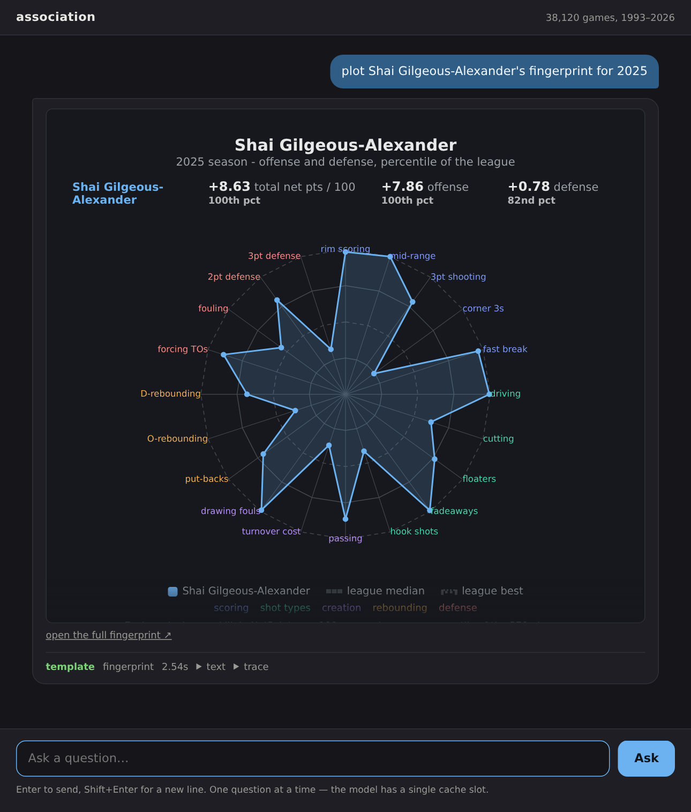

# association

A local-first NBA stats pipeline: fetch from ESPN's stats APIs into Parquet,
build a DuckDB analytics warehouse from it, and ask questions about it in
plain English — answered by a local LLM via [Ollama](https://ollama.com), with
no cloud API calls anywhere.

## Ask it something

```bash
pip install 'association[web]'
association web
# association is serving at http://127.0.0.1:40525  (ctrl-c to stop)
```


No default port — it binds a free one and prints the URL for your terminal to
linkify. Common question shapes are rendered from structured data: leaderboards
and game logs as tables, a multi-season history as a sparkline, a team's record
as a card. Anything without a renderer still answers, in the same text the CLI
prints — and every rendered answer keeps that text one click away.

Every answer says whether a **template** or the fall-through **agent** produced
it, because that is the most useful thing you can know about how far to trust
it. Each message is a new question; there is no conversation memory yet.

Shot charts and NetPoints fingerprints draw in the conversation, served from
the same directory the CLI writes to — so a chart made at the terminal opens in
the browser, and the CLI still writes the identical standalone file:



The page follows your system theme, and so do the charts — both screenshots
above are the same build, one light and one dark.

## Or from the command line

```bash
association query "who led the league in assists this season?"
# Nikola Jokic led the league in assists per game in the 2026 regular season, at 10.7.
# Next: Cade Cunningham (9.9), Josh Giddey (9.1), Luka Doncic (8.3), Ja Morant (8.1), ...

association query "how many times did the 76ers play the Celtics this season?"
# The Philadelphia 76ers and the Boston Celtics met 4 times in the 2026 regular
# season, splitting them 2-2.

association query "Luka Doncic vs Shai Gilgeous-Alexander this season"
# Luka Doncic vs Shai Gilgeous-Alexander, 2026 regular season:
#                     Luka Doncic  Shai Gilgeous-Alexander
# games                        64                       68
# points                     33.5                     31.1

association query "top 5 rebounders on the Lakers in the playoffs"
# Deandre Ayton led the Los Angeles Lakers in rebounds per game in the 2026
# postseason, at 9.6. Next: LeBron James (6.7), Rui Hachimura (4), Austin Reaves (4), ...

association query "Steph Curry's 3pt percentage over the past 4 seasons"
# Stephen Curry, 3PT% by regular season (most recent first):
# season   G  3PT%  3PM  3PA
#   2026  43  39.3  190  484
#   2025  70  39.7  311  784
#   2024  74  40.8  357  876
#   2023  56  42.7  273  639

association query "who had the most assists in a single game this season?"
# Ryan Nembhard had the most assists in a single game in the 2026 regular season:
# 23, on 2026-04-13 vs CHI. Next: Isaiah Collier (22), Josh Giddey (19).
```

Questions like these hit a fast path and typically answer in a couple of
seconds. Anything outside that set still gets answered — it falls through to
a general-purpose agent that writes its own SQL against the warehouse, just
more slowly.

Some questions render a chart instead of text:

```bash
association query "plot Stephen Curry's shot chart from his last game this season"
# Rendered shot chart for Stephen Curry (7/14 made, 50.0%) to query_output/shotchart_stephen_curry_401811054.html
```


That needs play-by-play data pulled first (`--include-pbp`), and writes a
self-contained, theme-aware HTML/SVG file — open it in a browser.

A player's NetPoints "fingerprint" — how they add value, across 20 play-type
skills — renders the same way, and needs no play-by-play:

```bash
association query "plot Shai Gilgeous-Alexander's fingerprint for 2025"
# Rendered NetPoints fingerprint (total) for Shai Gilgeous-Alexander (2025, percentile scale) to query_output/fingerprint_shai_gilgeous_alexander_2025_total_percentile.html
```


Naming two players draws both on the same axes and shades each skill to
whoever leads it.

## Features

- **Resumable, rate-limited fetch** from ESPN's stats APIs — checkpointed per
  game and season, safe to interrupt, cheap to re-run
- **A local DuckDB warehouse** built from the Parquet on disk, rebuildable any
  time without touching the network
- **Data coverage auditing** — cross-check what's on disk against what ESPN
  reports, optionally live
- **Natural-language queries with no cloud calls** — everything runs against
  a local Ollama model
- **Fast, deterministic answers** for common question shapes (leaderboards,
  head-to-head, comparisons, game logs, shot charts, fingerprints,
  multi-season history, …),
  with a tool-calling agent as fallback for anything else
- **Computed advanced stats** ESPN's API doesn't expose directly — true
  shooting %, effective FG%, usage rate, game score
- **NetPoints ratings** from ESPN Analytics — player/team ratings plus a
  per-play-type "fingerprint" breakdown, as numbers or as a radar plot
- **A local web interface** (`association web`) — the same answers in a
  chat-shaped page, rendered as tables, sparklines and cards per question
  shape, with progress streamed while a slow question runs
- **A full trace of every query** — command, tool calls, timing, and answer —
  written to disk regardless of verbosity
- **Shell completion** for bash, zsh, and fish

## Setup

```bash
uv tool install git+https://github.com/jeffknupp/association@v1.4.0
brew install ollama               # or see https://ollama.com/download
ollama serve &
ollama pull qwen2.5:3b            # router, the fast path - required, ~1.9GB
ollama pull qwen2.5:7b            # fall-through agent - required, ~4.7GB
ollama pull qwen3:8b              # optional: visible reasoning (--think), ~5.2GB
```

Both of the first two models are needed: the router classifies the question and
the fall-through agent handles anything the templates don't cover.

> **Note** — `pip install association` does not work yet. The PyPI project is
> unreachable pending an account-access issue, so releases live on GitHub only
> for now — install from the tag as above. Releases cut from here on also
> attach their wheel and sdist to the
> [releases page](https://github.com/jeffknupp/association/releases). This note
> goes away once PyPI publishing is restored.

To work on `association` itself, clone the repo and `uv sync --extra dev`
instead of installing from PyPI.

### Hardware

Recommended: 16GB of RAM. The router and fall-through models together use
about 7GB once both are loaded, leaving headroom for DuckDB and the OS. No GPU
is required.

On a lighter machine, the router model alone (`qwen2.5:3b`) covers most
everyday questions through the fast path. Skip pulling `qwen2.5:7b` if RAM is
tight — questions the fast path can't answer will just fail instead of
falling through, rather than running slowly.

### Shell completion

Tab-complete subcommands, options, and `--log-level`'s choices — generated
directly from the CLI's own command definitions, so there's nothing to keep in
sync by hand.

```bash
# bash
echo 'source /path/to/association/completions/association.bash' >> ~/.bashrc
# zsh
echo 'source /path/to/association/completions/association.zsh' >> ~/.zshrc
# fish
cp completions/association.fish ~/.config/fish/completions/
```

Or generate it fresh, which picks up any future CLI changes automatically:

```bash
eval "$(_ASSOCIATION_COMPLETE=bash_source association)"   # bash, in ~/.bashrc
eval "$(_ASSOCIATION_COMPLETE=zsh_source association)"    # zsh, in ~/.zshrc
_ASSOCIATION_COMPLETE=fish_source association | source    # fish, in ~/.config/fish/config.fish
```

## Documentation

Full documentation — architecture, a command reference, usage recipes, data
source notes, and the complete API — is at
[association.readthedocs.io](https://association.readthedocs.io/en/latest/),
or build it locally:

```bash
uv sync --extra docs
scripts/build_docs.sh          # docs/_build/html/index.html
```

## Data

Fetches teams, games/box scores, standings, player and team season stats,
ESPN's Basketball Power Index, and optionally play-by-play, shot charts, and
win probability. It also pulls NetPoints — ESPN Analytics' advanced
player/team rating — from a separate, unauthenticated source. See
[Data sources](https://association.readthedocs.io/en/latest/data-sources.html)
for exactly what's fetched from where, and
[Architecture](https://association.readthedocs.io/en/latest/architecture.html)
for how the warehouse and query engine are built from it.

## Project layout

```
src/association/
  cli.py            entrypoint: data pull|load|check, query, web
  fetch/            client, endpoints, parse, storage, pipeline, warehouse
  check/            data coverage report, cross-checked live against ESPN
  query/            intent router, query templates, entity resolution, leaderboard, shot chart, fingerprint, prompt/knowledge base, tools, court and radar renderers, agent loop
  web/              the local web interface: HTTP API, one-at-a-time runner, single-page app
scripts/
  backfill_markers.sh   re-derive completion markers for data fetched before they existed
  check_routing.py      routing regression check for the query fast path (needs ollama)
  bench_router_models.py  score candidate router models on that same question set
completions/          generated bash/zsh/fish shell completion scripts
tests/              pytest, one file per source module
.history/           per-run command/trace/timing logs from query|ai (gitignored)
```

## Development

```bash
uv sync --extra dev
pre-commit install     # one-time, wires the git hook
pytest -q
```

`ruff` and `mypy` run as pre-commit hooks, along with docstring coverage and
type completeness checks on `src/`. The same checks run in CI on push and pull
request, alongside the docs build. Any commit touching `src/` must also update
[CHANGES.md](https://github.com/jeffknupp/association/blob/master/CHANGES.md),
enforced by a pre-commit hook.

## Known limitations

- ESPN's stats API is undocumented and unofficial — endpoints or shapes can
  change without notice.
- ESPN's own Real Plus-Minus (RPM) isn't available at a stable JSON endpoint —
  NetPoints (see above) is its successor and *is* included. PER, Win Shares,
  BPM, and VORP are not included; see the computed advanced stats notes in the
  docs for why.
- NetPoints only has data back to the 2018-19 season — nothing earlier exists
  on their side.
- `net_points_team` (season-level) only ever reflects the current season;
  `net_points_team_game` (per-game, `--include-net-points-daily`) has full
  history instead.
- `net_points_player_game` matches players by exact display-name text, so
  spelling differences between sources can leave a real player's game rows
  unmatched rather than wrongly matched.
- `data check --live` cross-checks are opt-in and can be slow for seasons
  without a local completion marker yet — `pull` first to build those up.
