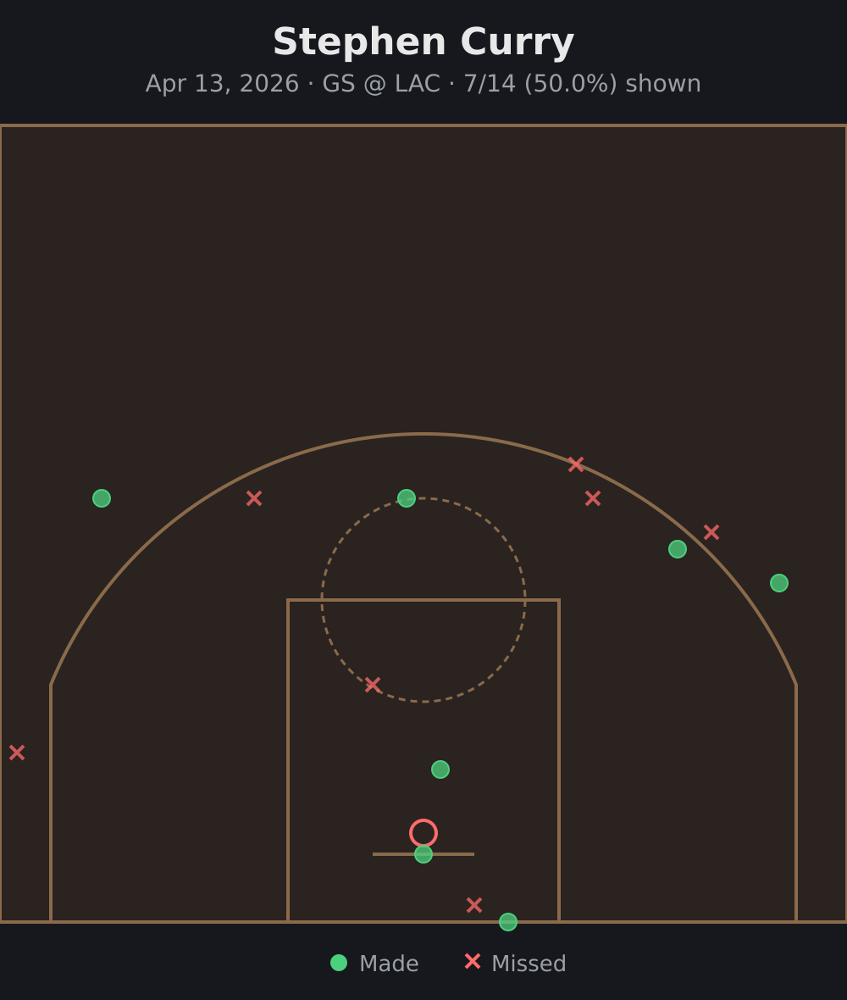
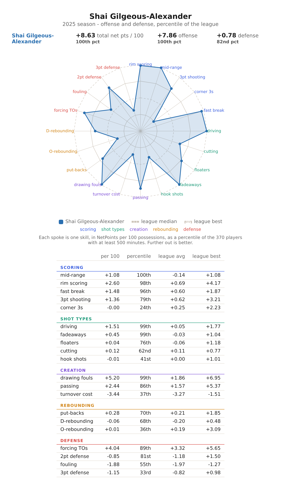
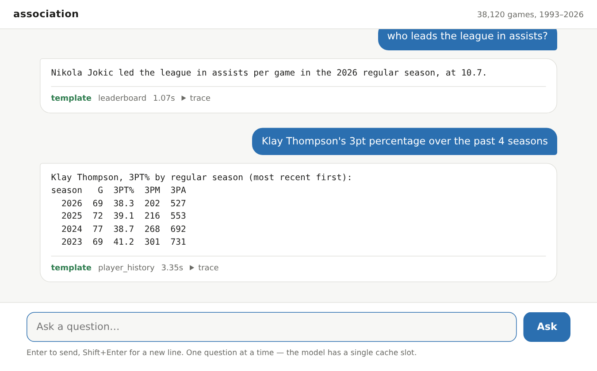

Usage recipes
=============

Worked examples for the things you actually do. Every command is safe to
re-run: fetches are checkpointed, and warehouse builds are idempotent.

Fetching a range of seasons
---------------------------

``season`` follows ESPN's convention — the year a season **ends**, so the
2023-24 season is ``2024``.

.. code-block:: console

   $ association data pull --seasons 2022-2026

That pulls regular season and postseason (``--season-types`` defaults to
``2,3``) and builds the warehouse afterwards. It is a background task: at the
default 5 requests/second, several seasons take a while, and there is no reason
to raise the limit.

Add play-by-play — which is where shot charts and win probability come from —
with ``--include-pbp``. It costs no extra requests, only parse time and disk:

.. code-block:: console

   $ association data pull --seasons 2026 --include-pbp

NetPoints, including the play-type fingerprint, is a separate opt-in because it
needs a credential exchange (see :doc:`data-sources`):

.. code-block:: console

   $ association data pull --seasons 2026 --include-net-points-daily

Interrupting any of these is safe. Re-running skips whatever already completed.

Checking data consistency
-------------------------

Report what is on disk, per season and season type, without touching the
network:

.. code-block:: console

   $ association data check --seasons 2026

To cross-check against what ESPN says *should* exist — the real test of whether
a pull is complete — add ``--live``:

.. code-block:: console

   $ association data check --seasons 2022-2026 --live

``--live`` only re-verifies seasons not already checkpointed complete; add
``--force`` to re-verify everything.

Note that a missing game is not always a gap. Postponed, cancelled and
forfeited games are recorded as such, and :mod:`association.check.report`
accounts for them rather than reporting them as missing data.

Forcing a refetch
-----------------

Checkpointing means a completed season is skipped. When you actually want the
data again — a parser fix, or a suspicion that ESPN backfilled something —
``--force`` ignores the checkpoints:

.. code-block:: console

   $ association data pull --seasons 2026 --force

Use it narrowly. ``--force`` over a wide range re-downloads everything.

If the fix is in *parsing* rather than fetching, you do not need the network at
all — rebuild from the Parquet already on disk:

.. code-block:: console

   $ association data load
   $ association data load --tables games,player_box_stats   # a subset, faster

Keeping a season up to date
---------------------------

During a live season the current year is never "complete", so re-running the
pull picks up new games and refreshes season aggregates:

.. code-block:: console

   $ association data pull --seasons 2026

Run it as often as you like — completed games are checkpointed and skipped, so
a daily update fetches roughly a day's worth of work. Season-aggregate
endpoints (standings, season stats, power index) are treated as live and
refreshed while the season is in progress, so per-game averages do not go
stale.

How fast a pull goes
--------------------

Fetching is bound by how long ESPN takes to answer, not by your bandwidth, disk
or CPU. Profiling a live pull put 96% of the main thread inside a single curl
call, at 5% CPU and zero bytes read from disk. A *cold* game summary — an old
season nobody has requested lately — takes 250-400ms to come back; a warm one
takes 30ms. The round trip to the CDN is 12ms of that, so almost all of it is
the origin thinking.

``--workers`` (default 4) sets how many of those requests are in flight at
once. It does not raise how hard this hits ESPN: ``--rate-limit`` still bounds
the request *rate* across all workers, and before this existed a pull could not
even reach the limit it was given — requests were issued one at a time, so
``--rate-limit 10`` ran at 2.4 requests/second and the limiter never once had to
sleep. Measured over 12 cold games: 2.32/s serial, 5.95/s with four workers.

Past roughly ``rate_limit × latency`` workers there is nothing left to gain —
the rate limit becomes the binding constraint instead of the latency. Use
``--workers 1`` for the old serial behavior.

Re-running a pull over seasons that are already complete costs a handful of
:func:`os.stat` calls and nothing else — no requests, and no warehouse rebuild:

.. code-block:: console

   $ time association data pull --seasons 2024
   NetPoints already on disk for 2024 - skipping
   season 2024 type 2 already complete - skipping
   season 2024 type 3 already complete - skipping
   nothing fetched - warehouse left as it is (use `association data load` to rebuild it anyway)
   real 0m0.477s

Two things make that true. A pull only fetches NetPoints for the seasons it was
asked for — the source is one league-wide file covering every season, so a pull
of 2024 used to download and reparse all of it and rewrite the *current*
season's file as a side effect. And the warehouse is reloaded only for the
tables the run actually wrote: a full rebuild rescans the entire Parquet tree,
which on a mature warehouse is over a hundred thousand files.

The consequence worth knowing: NetPoints for a season you have not pulled will
not appear by pulling a different one. Pull the range you want
(``--seasons 2019-2026``), or ``association data load`` after the fact.

Asking questions
----------------

One-shot:

.. code-block:: console

   $ association query "who leads the league in assists?"
   Nikola Jokic led the league in assists per game in the 2026 regular season, at 10.7.

.. code-block:: console

   $ association query "how many times did the 76ers play the Celtics this season?"
   The Philadelphia 76ers and the Boston Celtics met 4 times in the 2026 regular
   season, splitting them 2-2.

.. code-block:: console

   $ association query "Klay Thompson's 3pt percentage over the past 4 seasons"
   Klay Thompson, 3PT% by regular season (most recent first):
   season   G  3PT%  3PM  3PA
     2026  69  38.3  202  527
     2025  72  39.1  216  553
     2024  77  38.7  268  692
     2023  69  41.2  301  731

Add ``--verbose`` to watch the routing decision and every tool call as they
happen. The same trace is always written to ``.history/`` regardless, so a
surprising answer can be diagnosed after the fact:

.. code-block:: console

   $ association query --verbose "most games with 20+ rebounds this season?"
     [timing] model inference #1: 1.46s
     -> (router) intent='threshold_count' slots={'stat': 'rebounds', 'threshold': 20, 'season': 2026, 'season_type': 2}
     [timing] template threshold_count: 0.02s
   Nikola Jokic had the most games with 20+ rebounds in the 2026 regular season, with
   5. Next: Karl-Anthony Towns (3), Donovan Clingan (2), Andre Drummond (1), Bam Adebayo (1).

Shot charts
-----------

Needs play-by-play data (``--include-pbp``, see above) for the seasons
involved:

.. code-block:: console

   $ association query "plot Stephen Curry's shot chart from his last game this season"
   Rendered shot chart for Stephen Curry (7/14 made, 50.0%) to query_output/shotchart_stephen_curry_401811054.html

The command writes a self-contained, theme-aware HTML/SVG file rather than
printing to the terminal — open it in a browser. It looks like this:

   Stephen Curry, April 13, 2026 (GS @ LAC) — real output from the query above.

NetPoints fingerprints
----------------------

A fingerprint is how a player adds value rather than how much: their NetPoints
split across 20 play-type skills, in net points per 100 possessions. It needs
only the NetPoints data (pulled by default), not play-by-play:

.. code-block:: console

   $ association query "plot Shai Gilgeous-Alexander's fingerprint for 2025"
   Rendered NetPoints fingerprint (total) for Shai Gilgeous-Alexander (2025, percentile scale) to query_output/fingerprint_shai_gilgeous_alexander_2025_total_percentile.html

   Shai Gilgeous-Alexander, 2025 — real output from the query above.

The skills are grouped as espnanalytics.com's own Skill Fingerprint groups
them, since that is where the numbers come from: scoring, shot types, creation,
rebounding and defense. Each spoke is a percentile against every player with at
least 500 minutes that season, so further out is better on every axis — net
points are already signed toward "good", and a turnover category is negative on
offense and positive on defense. The same numbers are repeated in the table
underneath: a radar is a shape, and the table is what makes it checkable.

Two things it will not do. It will not plot one game — the warehouse has an
offense/defense/total split per game but no play-type breakdown, so a question
about a single game is answered with that fact rather than with the season's
shape. And it will not plot a career: a fingerprint is one season.

Naming two players draws both polygons on the same axes and shades each skill
in the color of whoever leads it, more strongly the further ahead they are:

.. code-block:: console

   $ association query "compare Shai Gilgeous-Alexander and Nikola Jokic's fingerprints for 2025"

Asking in a browser
-------------------

``association web`` serves a local chat-shaped page over the same pipeline:

.. code-block:: console

   $ association web
   association is serving at http://127.0.0.1:40525  (ctrl-c to stop)

There is no default port. It binds a free one and prints the URL, which every
modern terminal turns into a link — nothing to remember and nothing to collide
with. ``--port`` is there for anyone who wants to bookmark one, and
``--db-path``/``--out-dir`` take the same defaults the ``data`` subcommands do.

   Two questions, answered by templates. Real output.

It needs the ``web`` extra, which is not installed by default:

.. code-block:: console

   $ pip install 'association[web]'

Three things about it are deliberate:

* **Each message is a new question.** There is no conversation memory yet, so
  "what about last year?" will not work. That is a real change in what a
  question *means* and it deserves its own routing cases rather than arriving
  as a footnote to a UI release.
* **Every answer says which path produced it** — ``template`` in green, with
  the intent, or ``agent`` in orange. Whether a template built the sentence
  from code or a 7B model wrote the SQL is the most useful single thing you can
  know about how far to trust an answer, so it is never hidden.
* **One question at a time.** ollama keeps a single KV cache slot per model, so
  two questions in flight would evict each other's prefix and both come back
  slow. A question that arrives while another is running is told it is waiting.

A question that falls through to the agent can take minutes, and the page
streams the trace while it does — the same lines ``--verbose`` prints — because
a spinner for two minutes is indistinguishable from a hang.

The server binds to localhost and has no authentication. It has no business
being reachable by anything but you.

Setting up the models
---------------------

Two models, for the two jobs described in :doc:`architecture`. :doc:`installation`
has the ``ollama pull`` commands; both fit in memory together.

If a question falls through to the agent it will take noticeably longer — that path prefills a much larger prompt — which is
expected, not a fault.

``--no-fast-path`` forces every question through the agent, which is useful for
comparing the two paths but slow.
